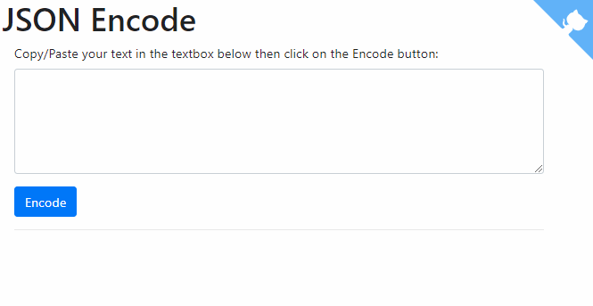

# JSON Encode


Very straight-forward script for encoding string in JSON.

Format string like, f.i.,

```
Nuit d'Été, ç'eût
```

into

```
Nuit d'\u00c9t\u00e9, \u00e7'e\u00fbt
```

## How to use

Just copy/paste your text into the text box as illustrated here below and click on the `Encode` button.


